# Dockerise, Build and Push My Protfolio Web Application 
## Automatiing the Deployment of Web Application with Continuous Integration

## Overview
This project demonstrates how to automate the building and deployment of my Docker Portfolio using **GitHub Actions Pipeline**. Incorporating **Continuous Integration (CI)** in the deployment of my web application for a DevOps portfolio is crucial for ensuring consistent, reliable, and automated builds and deployments. Continues Integration allows for early detection of integration issues, streamlines the deployment process, and enables faster feedback loops, ultimately leading to more efficient and robust application delivery.

## Step-by-Step Process

### 1. Create a GitHub Repository
Icreated a new GitHub repository for this project locally using Github CLI (gh). This [repo](https://github.com/JonesKwameOsei/Containerise-My-Docker-Developer-Portfolio) will be the central location for the code, configurations, and the GitHub Actions workflow.<p>

### 2. Create the Dockerfile and Package File
In the repository:
- Create a file called Dockerfile.
```
vi Dockerfile
```
- Add these lines of codes:
```
# Use the official Nginx image from the Docker Hub
FROM nginx:alpine

# Copy the website files into the container
COPY . /usr/share/nginx/html

# Expose port 80 to the outside world
EXPOSE 80

# Run Nginx in the foreground
CMD ["nginx", "-g", "daemon off;"]
```
### 3. Set up the Docker Build Workflow
In the GitHub repository, create a new folder named `.github/workflows`. This is where the GitHub Actions workflow is defined.

Inside the `workflows` folder, create a new file named `dockerhub-push.yml`. This file will contain the configuration for the Docker build workflow.

```
name: ci

on:
  push:
    branches:
      - main

jobs:
  build:
    runs-on: ubuntu-latest
    steps:
      -
        name: Login to Docker Hub
        uses: docker/login-action@v3
        with:
          username: ${{ vars.DOCKER_USERNAME }}
          password: ${{ secrets.DOCKERHUB_TOKEN }}
      -
        name: Set up Docker Buildx
        uses: docker/setup-buildx-action@v3
      -
        name: Build and test
        uses: docker/build-push-action@v6
        with:
          target: test
          load: true
      -
        name: Build and push
        uses: docker/build-push-action@v6
        with:
          platforms: linux/amd64,linux/arm64/v8
          push: true
          #target: prod
          tags: ${{ vars.DOCKER_USERNAME }}/${{ github.event.repository.name }}:1.0.0
```

This workflow will be triggered on push and pull request events to the `main` branch. It performs the following steps:

1. Checks out the repository code.
2. Sets up the Docker Buildx environment for multi-architecture builds.
3. Logs in to the GitHub Container Registry (ghcr.io) using the `GITHUB_TOKEN` secret.
4. Builds the Docker image and pushes it to the GitHub Container Registry, tagging it with the current commit SHA.

### 4. Generate Docker Hub Access Token
By providing the Docker Hub access token as a secret in the GitHub Actions workflow, we can securely authenticate your workflow and grant it the required permissions to push the Docker image to the desired registry location on Docker Hub.

This approach is a best practice for managing credentials in the CI/CD pipelines, as it separates the sensitive information from the workflow code and ensures better security and maintainability of the build and deployment processes.
- In `Docker Hub`, click on the `Docker Hub Profile` on the top right corner.<p>
- Select `Account Serrings`.
- Under `Security`, Select `Personal Access Token`.<p>
- Click the `Create New Token` button.<p>
- In the `Access Token Description` field, enter a description `GithubAction` for the token.<p>
- Next in the `Access Permission`, select `Read and Write` and click `Generate Token`.
- Copy the token generated and close the pane. <p>

### 5. Store Secrets in Github Actions
1. In the Github repo, click on settings.
2. On the left silde, find `Secrets and Variables`, click the dropdown and select `Actions`.
3. Under the `Repository secrets`, click on the green button, `New repository Secret`.
4. Under the `Repository variables`, click on the green button, `New repository Variable`.
5. For `Name` and `Secret`, enter details of the following:<p>

|Name|Secret|
|----|------|
|DOKERHUB_TOKEN|The access token generated|<p>

|Name|Variable|
|----|------|
|DOKERHUB_USERNAME|docker username|<p>

The configuration should look like this:<p>
<p>

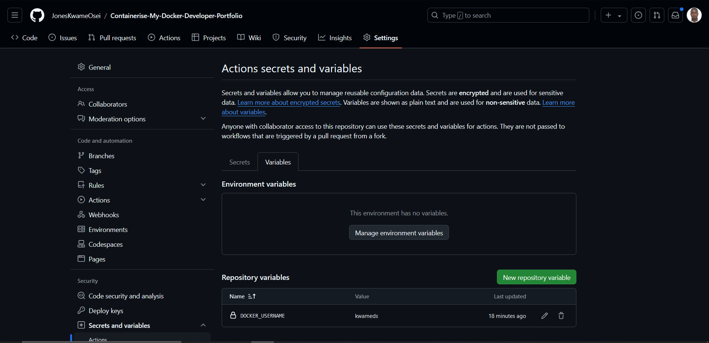<p>

### 7. Manually build and Push the Docker Image Locally
Navigating to the directory containing the Dockerfile, I will run:

```bash
docker build -t kwameds/docker-portfolio:v1 .
```
Image is built:<p>
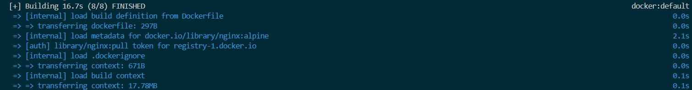<p>

The image took 16.7 seconds to be built. This can be improved by either using docker biuld cache or docker biuld cloud. Nonetheless, building the image the second time will be faster if the commands and context remain unchanged.

I can verify from on Docker CLI if the image is actually built. To do this, run:

```bash
docker image ls
```
> Output:

```
REPOSITORY                         TAG       IMAGE ID       CREATED          SIZE
kwameds/docker-portfolio           v1        cd868306f361   11 minutes ago   99.9MB
```
The images was created 11 minutes ago with the size 99.9MB.

Next, I will run the Docker Image Locally. This is to test the image locally to ensure it works correctly.

```bash
docker run -dp 8080:8080 --name docker-portfolio kwameds/docker-portfolio:v1
```

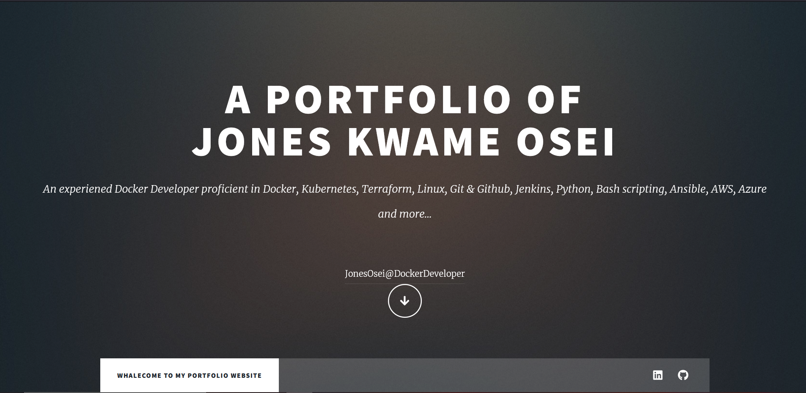<p>

Check containers running: <p>

```bash
docker container ls
```

> Output:
>
```bash
CONTAINER ID   IMAGE                         COMMAND                  CREATED              STATUS              PORTS                            NAMES
51562dff3b67   kwameds/docker-portfolio:v1   "/docker-entrypoint.…"   About a minute ago   Up About a minute   80/tcp, 0.0.0.0:8080->8080/tcp   docker-portfolio
```

### Using a Multi-stage Build:
`Multi-stage` builds in Docker can help speed up the image building process and make the final image smaller. This is achieved by creating a cleaner separation between the building of the image and the final output.<p>
In a `traditional build` (as I did above), *all build instructions are executed in sequence*, and in *a single build container*: **downloading dependencies, compiling code, and packaging the application**. All those layers end up in the final image. This approach works, but it leads to bulky images carrying unnecessary weight and increasing your security risks. Hence, The image size, 99.9MB.<p>
Multi-stage builds introduce multiple stages in the Dockerfile, each with a specific purpose. By separating the build environment from the final runtime environment, it can significantly reduce the image size and attack surface. This is especially beneficial for applications with large build dependencies.

Creating a multi-stage Dockerfile:<p>

```bash
# Stage 1: Production Stage
FROM nginx:alpine AS build

# Set working directory (optional, but good practice)
WORKDIR /usr/share/nginx/html

# Copy only the static files that rarely change first

COPY images/ images/
COPY assets/css/ assets/css/
COPY assets/js/ assets/js/
COPY assets/webfonts assets/webfonts/
COPY assets/sass/ assets/sass/
COPY index.html ./


# Expose port 80
EXPOSE 80

# Start Nginx server
CMD ["nginx", "-g", "daemon off;"]
```
**Build the image**:

```bash
docker build -t kwameds/docker-portfolio:v2 .
```
> Output:
>
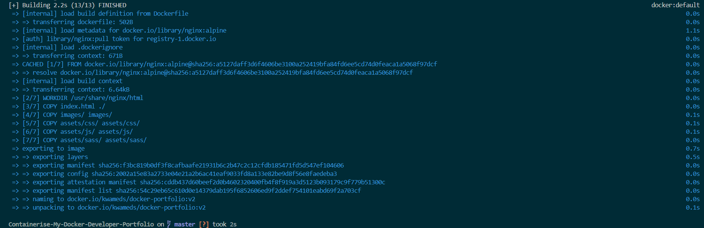

The image took just 2.2 seconds to be built. Faster ther the earlier build. Let's check the size of the second image. <p>
```bash
docker image ls
```
> Output:
>
```bash
REPOSITORY                         TAG       IMAGE ID       CREATED          SIZE
kwameds/docker-portfolio           v2        54c29eb65c61   14 minutes ago   95.6MB      <==================================== v2 size is 4MB lesser than the v1
kwameds/docker-portfolio           v1        cd868306f361   59 minutes ago   99.9MB
```

### 8. Automate the deployment process with a GitHub CI/CD Pipeline 
Having tested the build and run locally, I will automate the build and also push (to Dockerhub) with Github Actions. 

1. Set up workflows. 
```bash
# Name of the Pipeline Actions
name: Build and Push Docker Image CI

on:
  push:
    branches:
      - main

jobs:
  push_to_registry:
    name: Push Docker image to Docker Hub
    runs-on: ubuntu-latest
    
    steps:
      - name: Check out the repo
        uses: actions/checkout@v4
      
      - name: Login to Docker Hub
        uses: docker/login-action@v3
        with:
          username: ${{ vars.DOCKER_USERNAME }}
          password: ${{ secrets.DOCKERHUB_TOKEN }}
      
      - name: Set up Docker Buildx
        uses: docker/setup-buildx-action@v3
    
      - name: Build and push Docker image
        uses: docker/build-push-action@v6
        with:
          platforms: linux/amd64,linux/arm64/v8
          context: .
          push: true
          tags: ${{ vars.DOCKER_USERNAME }}/${{ github.event.repository.name }}:1.0.0
```

2. Add the changes and commit
```
git add .
git commit -m "Added configuration files"
```
1. Push the commit to trigger the actions
```
git push origin main
```

The pipeline actions has been executed:<p>
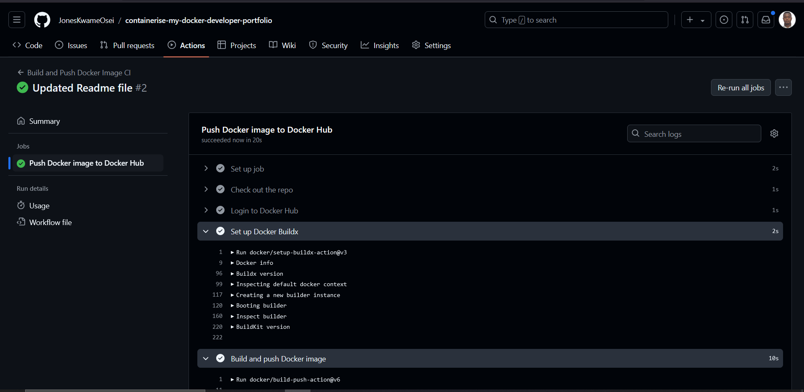<p>
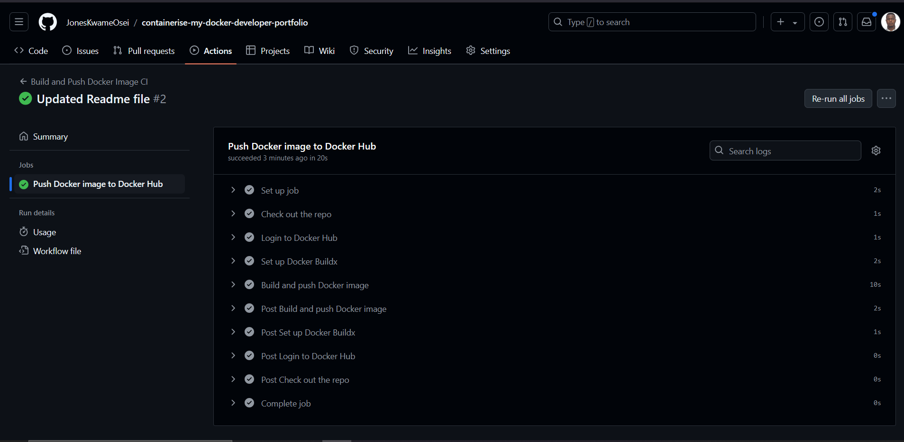<p>

GitHub action completed. I will confirm if the the image is in the `Docker Hub` registry. 
Image in docker hub.<p>
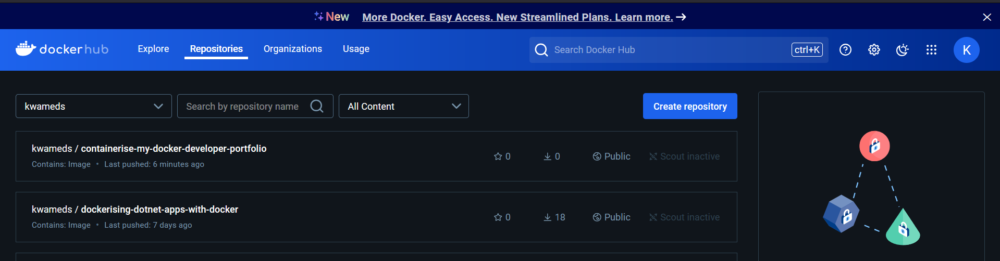<p>
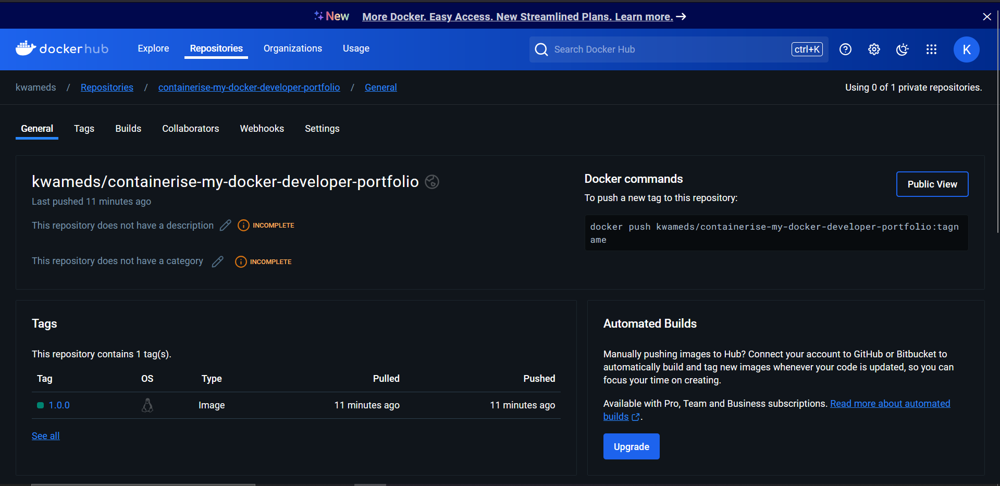<p>

### Test the New Image
Having automatically build and pushed the image to Docker Hub, it is important to run the application to verify if it is working. Run:
```
docker run -d -p 80:80 --name docker-portfolioapp kwameds/containerise-my-docker-developer-portfolio:1.0.0
```
Docker pulled the image from my repo in the Docker Hub registry as it couldn't find the image locally. Docker goes ahead to run a container based on that image. The `-d` option runs the container in detached mode, `-p 80:80` maps the `host's port 80` to the `container's port 80`, and `--name docker-portfolioapp` assigns the name **newCVapp** to the container.<p>

> Output:
>
```sh
Unable to find image 'kwameds/containerise-my-docker-developer-portfolio:1.0.0' locally
1.0.0: Pulling from kwameds/containerise-my-docker-developer-portfolio
55c8710017d5: Download complete 
2bb9fc0820a2: Download complete 
22305e29ea1b: Download complete 
6dfc83f8bf4e: Download complete 
3d61522191bb: Download complete 
Digest: sha256:15f34428135a7c1a1c8dxxxxxxxxxxxxxxxxxxxxxxxxxxxxxxxxxxxxxxxxxxxxxxx
Status: Downloaded newer image for kwameds/containerise-my-docker-developer-portfolio:1.0.0
```

Let us confirm if the image is now in our local registry by running:<p>
```bash
docker image ls                <============= lists all images
docker container ls            <============= lists containers running
```
> Output for image list
>
```sh
REPOSITORY                                           TAG       IMAGE ID       CREATED          SIZE
kwameds/containerise-my-docker-developer-portfolio   1.0.0     15f34428135a   19 minutes ago   99.6MB       <=================  image pulled from Dockerhub
kwameds/docker-portfolio                             v2        54c29eb65c61   2 hours ago      95.6MB
kwameds/docker-portfolio                             v1        cd868306f361   3 hours ago      99.9MB
```

> Output for image list
>
```sh
CONTAINER ID   IMAGE                                                      COMMAND                  CREATED         STATUS         PORTS                            NAMES
871dc8c288f9   kwameds/containerise-my-docker-developer-portfolio:1.0.0   "/docker-entrypoint.…"   4 minutes ago   Up 4 minutes   0.0.0.0:80->80/tcp               docker-portfolioapp
```
**Access the Portfolio on the browser**
Next, We will view the web app in the browser by typing: `http://localhost:80`. <p>
The web page is accessible: <p>
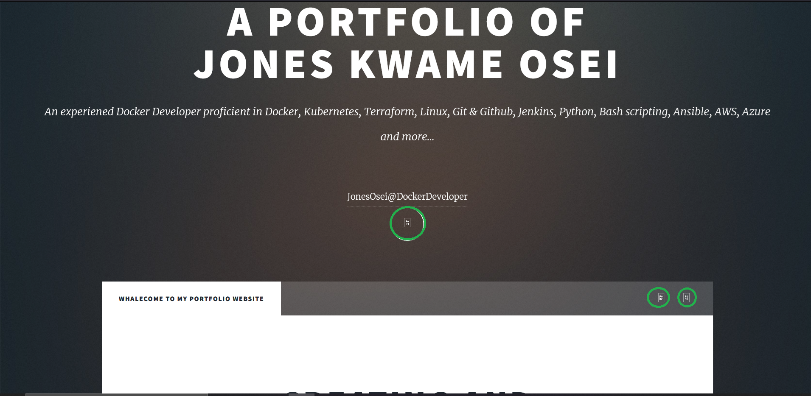<p>

The Portfolio can be accessed but there are some icons (circled in green that are defective). I will correct this error and build the app again as version 1.0.1.  

Professional summary updated and the continuous integration pipeline executed.<p>
<p>
<p>

Image buitlt and pushed to my repo in Docker Hub regisry.<p>
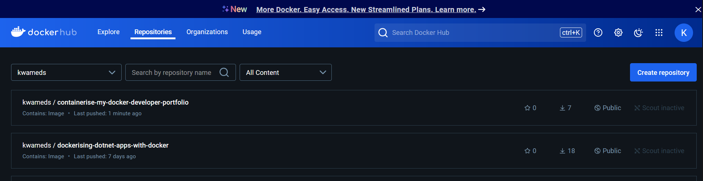<p>
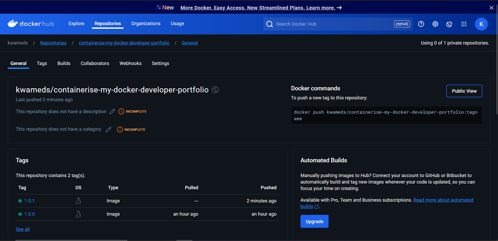<p>

Run image and view in the browser to confirm the update. <p> 

```
docker run -d -p 81:80 --name docker-portfolio-v2 kwameds/containerise-my-docker-developer-portfolio:1.0.1
```
Image pulled and container created:<p>
> Output:
>
```bash

```

The web application is accessible with `update`:<p>
<p>


## Conclusion
I have successfully integrated Docker into a development pipeline using `GitHub Actions`. This method enables automated build and push Docker images to a registry, ensuring that deployments are consistent and always reflect the latest code changes. This setup offers a dependable and effective way to handle Docker-based applications.

## What is Next?
Having completed the builds, I will deploy these dockerised applications (CV and Portfolio web apps) with `K8s`. 
